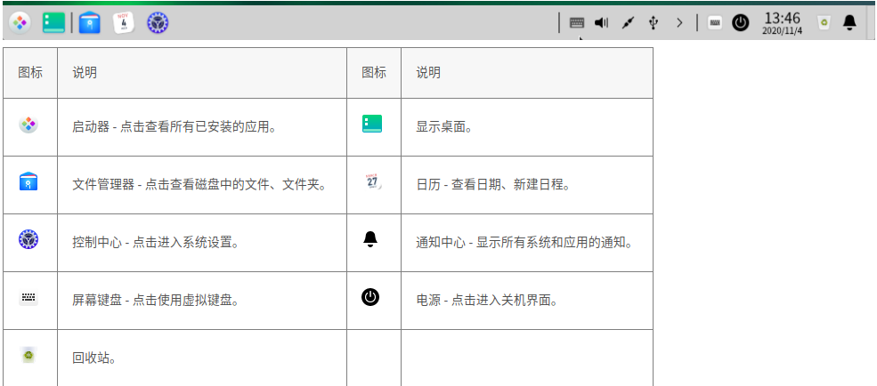
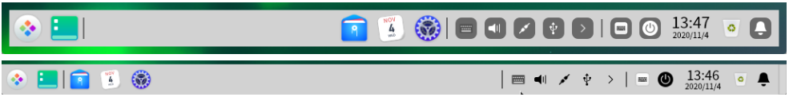
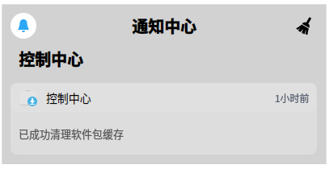

# dde-dock

#### 介绍
 任务栏是指位于桌面底部的长条，主要由启动器、应用程序图标、托盘区、系统插件等组成。在任务栏，您可以打开启动器、显示桌面、进入工作区，对其上的应用程序进行打开、新建、关闭、强制退出等操作，还可以设置输入法，调节音量，连接网络，查看日历，进入关机界面等。

#### 软件架构
软件架构说明

#### 安装教程

dnf install dde-dock

#### 使用说明

 1.认识任务栏图标

任务栏图标包括启动器图标、应用程序图标、托盘区图标、系统插件图标等。

2.切换显示模式

任务栏提供两种显示模式：时尚模式和高效模式，显示不同的图标大小和应用窗口激活效果。

您可以通过以下操作来切换显示模式：

 (1)右键单击任务栏。

  (2)在 **模式** 子菜单中选择一种显示模式。

3.设置任务栏位置

您可以将任务栏放置在桌面的任意方向。

 (1)右键单击任务栏。

 (2)在 **位置** 子菜单中选择一个方向

4.调整任务栏高度

鼠标拖动任务栏边缘，改变任务栏高度。

5.显示/隐藏插件

(1)右键单击任务栏。

(2)在 **插件** 子菜单中勾选或取消勾选 **回收站、电源、显示桌面、屏幕键盘、通知中心、时间**，可以设置这些插件在任务栏上的显示和隐藏效果

6.查看通知

当有系统或应用通知时，会在桌面上方弹出通知消息。若有按钮，单击按钮执行对应操作；若无按钮，单击关闭此消息。

您还可以单击任务栏上的 ， 打开通知中心，查看所有通知

7.查看日期时间

(1)鼠标指针悬停在任务栏的时间上，查看当前日期、星期和时间。

(2)单击时间，打开日历

8.进入关机界面

您可以单击任务栏上的  进入关机界面，也可以在启动器的小窗口模式中单击 。

| 功能                                                         | 说明                                                    |
| :----------------------------------------------------------- | :------------------------------------------------------ |
| 关机 | 关闭电脑。                                              |
| 重启 | 关机后再次重新运行您的电脑。                            |
| 锁定 | 锁定电脑，或按下键盘上的 **Super** + **L** 组合键锁定。 |
| 切换用户 | 选择另一个用户帐户登录。                                |
| 注销 | 清除当前登录用户的信息。                                |
| 系统监视器 | 快速启动系统监视器。                                    |

#### 参与贡献

1.  Fork 本仓库
2.  新建 Feat_xxx 分支
3.  提交代码
4.  新建 Pull Request

#### 码云特技

1.  使用 Readme\_XXX.md 来支持不同的语言，例如 Readme\_en.md, Readme\_zh.md
2.  码云官方博客 [blog.gitee.com](https://blog.gitee.com)
3.  你可以 [https://gitee.com/explore](https://gitee.com/explore) 这个地址来了解码云上的优秀开源项目
4.  [GVP](https://gitee.com/gvp) 全称是码云最有价值开源项目，是码云综合评定出的优秀开源项目
5.  码云官方提供的使用手册 [https://gitee.com/help](https://gitee.com/help)
6.  码云封面人物是一档用来展示码云会员风采的栏目 [https://gitee.com/gitee-stars/](https://gitee.com/gitee-stars/)
